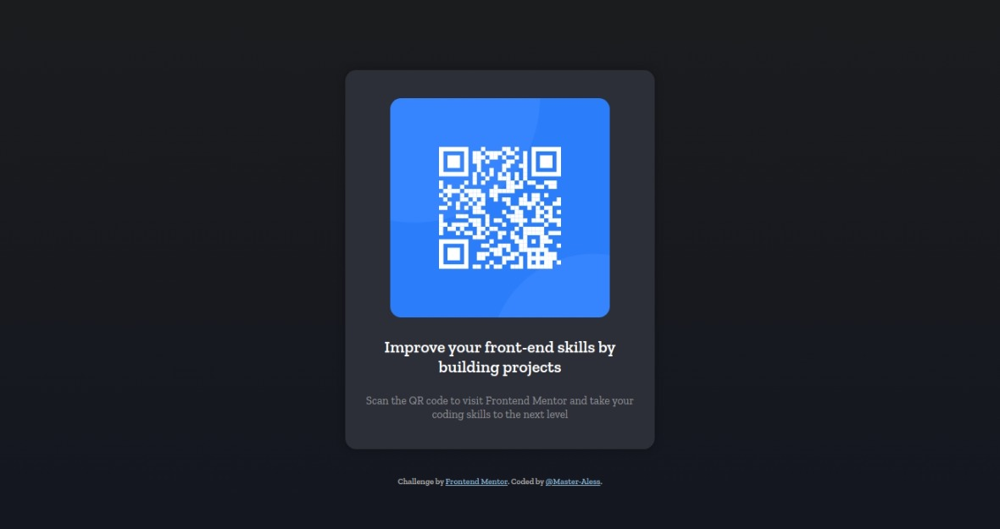

# Frontend Mentor - QR code component solution

This is a solution to the [QR code component challenge on Frontend Mentor](https://www.frontendmentor.io/challenges/qr-code-component-iux_sIO_H). Frontend Mentor challenges help you improve your coding skills by building realistic projects.

## Table of contents

- [Overview](#overview)
  - [Screenshot](#screenshot)
  - [Links](#links)
- [My process](#my-process)
  - [Built with](#built-with)
  - [What I learned](#what-i-learned)
  - [Continued development](#continued-development)
  - [Useful resources](#useful-resources)
- [Author](#author)

## Overview

### Screenshot



### Links

- Solution URL: [https://rb.gy/zmaly](https://rb.gy/zmaly)
- Live Site URL: [Add live site URL here](https://your-live-site-url.com)

## My process

First of all, I decided to come with the mobile solution, so the first step is learn how to use **media queries** on css to design the mobile layout, and then, continue with the desktop one.

It was difficult for me at the beggining since I didn't know how to create the container or in this case the card, so I followed old code that I had made and guide myself, *at least* to make it work, so far, it seems to be working well.

...

After a short period of work and try and fail progress, I could handle how to make it work. I could create the responsive part, in fact, I learned that there should be create firstly the responsive part, then the tablet and desktop one.

### Built with

- Semantic HTML5 markup
- CSS
- Flexbox
- Media Queries ```CSS```

### What I learned

First of all, I learned that understanding **GIT** it's essential, it allows you to stick with the flow of the creation of the application

I'm very proud that I could also learn how to create a responsive website by using **media-queries**

```CSS
@media (max-width: 480px) {

  .container {
    
    margin: 10% auto;
    width: 275px;
    padding: 24px;
    border-radius: 16px;
    box-shadow: 0px 0px 12px rgba(0, 0, 0, .30);
    overflow: hidden;
    height: 425px;
    transition: all 0.5s ease-in-out;

  }
}

```

I learned how to center a div effectively, and now, the last part is the usefulness of knowing how to share my progress with other people, as if I were in a pro team

**Small detail:** The use of "transitions" in CSS which makes the website modern and smooth, also catchy as a result of the transitions.

### Continued development

I want to keep focusing my efforts in learning CSS and responsive design, in order to create better websites in the future 🔮

### Useful resources

- [Media Queries](https://www.w3schools.com/css/css3_mediaqueries.asp) - I needed the *how* to make responsive design wihout knowing anything, so I searched for the beggining.

## Author

- Website - [@Master-Aless](https://the-boxhead-guy.github.io/index.html)
- Frontend Mentor - [The-BoxHead-Guy](https://www.frontendmentor.io/profile/The-BoxHead-Guy)
- Twitter - [@yourusername](https://www.twitter.com/yourusername)
- LinkedIN - [Jhon Alessandro V](www.linkedin.com/in/jhon-alessandro-v-110895255)
