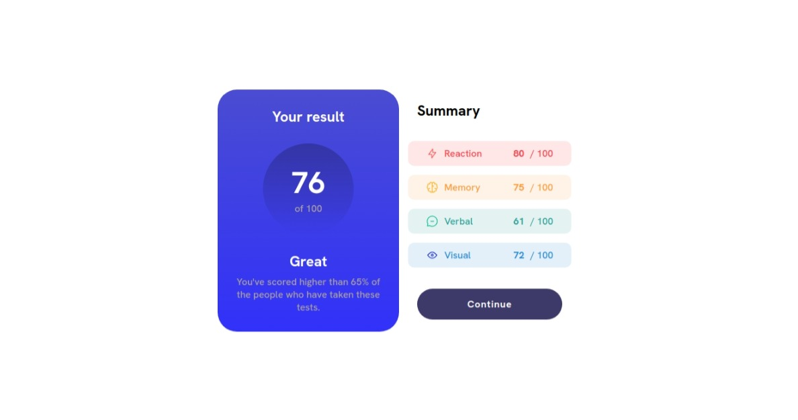
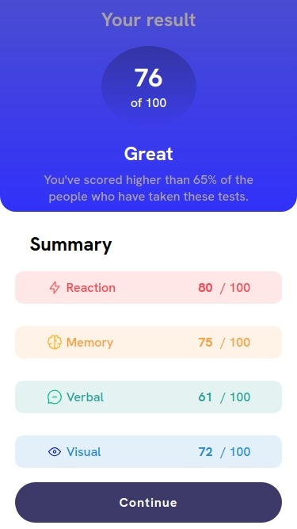

# Frontend Mentor - Results summary component solution

This is a solution to the [Results summary component challenge on Frontend Mentor](https://www.frontendmentor.io/challenges/results-summary-component-CE_K6s0maV). Frontend Mentor challenges help you improve your coding skills by building realistic projects.

## Table of contents

- [Overview](#overview)
  - [The challenge](#the-challenge)
  - [Screenshot](#screenshot)
  - [Links](#links)
- [My process](#my-process)
  - [Built with](#built-with)
  - [What I learned](#what-i-learned)
  - [Continued development](#continued-development)
- [Author](#author)
- [Acknowledgments](#acknowledgments)

## Overview

### The challenge

Users should be able to:

- Adapt to several screen sizes, feel welcome to experiment by using dev tools
- Observer that only the button has a **hover** effect by changing the color

### Screenshot

#### Desktop part

#### Responsive-part

### Links

- Solution URL: [css-results-summary-component](https://github.com/The-BoxHead-Guy/css-practices/tree/main/css-results-summary-component/results-summary-component-main)
- Live Site URL: [results summary component](https://results-summary-component-orcin-beta.vercel.app/)

### My process

#### Discovering Figma and conventional hand-paper methods of wireframes

The first thing I discovered is that in order to make the layout for the website, I needed at least the skeleton because I didn't know how to start.

So, with a *world-class* incredibly short learning of **Figma** and how to use:

- Frames
- Constraints

I could develop what I called *The non-exact but nice skeleton*, so I had in my mind the way to start this project effectively/

#### Short conclusion

The key to get this work done was the mindset of not giving up until it worked out.

There were many difficulties along the way, starting with the challenge of using flex-box without knowing about. Creativity and imagination plays an important role here.

Breaking the code can also help, it allows you how to figure out the best approach to solve a problem.

#### Box-model

One of the things that were incredibly difficult was reminding me of that each single **HTML** element it's a box, or at least, it's treated as a box that contains data, attributes, and states.

For example, in several cases, I forgot to put the *width* or *height* of the **div** element, and then having troubles by finding out why weren't the other elements behaving as I'd wanted to.

#### Using AI copilot to make things faster

Using AI as a your copilot while you're developing a solution it's excellent when there's repetitive things that must be done.

With only a command, and creativity, I set almost all the environment on the project, only to focus in its development

#### Shorten the code

I discover that when you use CSS, you can **re-use** code for other areas of the application.

That's great because it saves time, headaches, and it makes the project way more scalable.

### Built with

- Semantic HTML5 markup
- CSS custom properties
- CSS responsive design (Media queries)
- Figma (Using frames and constraints)
- Flexbox
- Codeium (copilot assistant)

### What I learned

What I learned the most was about being resilient throughout the entire building on the project.

It's pointless if there's isn't at least a small approach about how the solution is going to be developped

### Continued development

The next technique I would learn pretty well would be box-model, and flex-box, as well as understanding how to design a component or a simple website.

## Author

- Website - [masteraless.online](masteraless.online)
- Frontend Mentor - [@masteraless](https://www.frontendmentor.io/profile/The-BoxHead-Guy)
- Twitter - [@master_aless](https://twitter.com/Master_Aless)
- LinkedIN - [Jhon Alessandro V](www.linkedin.com/in/jhon-alessandro-v-110895255)

## Acknowledgments

I'd like to give a great thanks to dear friend **Francisco** who was behind all the process and he was pushing me to continue to do it despite of the difficulties.
